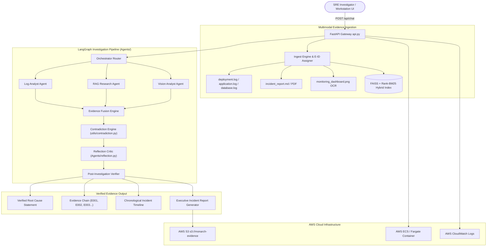

# 👑 Monarch — AI Incident Investigator

[](https://fastapi.tiangolo.com/)
[](https://langchain-ai.github.io/langgraph/)
[](https://aws.amazon.com/)
[](https://groq.com/)
[](https://www.docker.com/)

> **The Hackathon Winning Discipline**: *"Monarch doesn't just give you an AI answer — it investigates the evidence and shows you why the answer is true."*

**Monarch** is an **AI Incident Investigator** that turns messy production evidence across logs, post-mortems, metrics dashboards, and screenshots into a verified, traceable root-cause report.

---

## 🎬 3-Minute Video Demo Script & Breakdown

| Time Window | Phase | Demo Action & Screen Display |
| :--- | :--- | :--- |
| **0:00 - 0:15** | **The Problem** | Production outage occurs (`INC-042`). Evidence is scattered across application logs, database logs, post-mortem PDFs, and dashboard screenshots. |
| **0:15 - 0:30** | **1-Click Ingestion** | Click **"⚡ LOAD DEMO INCIDENT (INC-042)"**. Monarch ingests `deployment.log`, `application.log`, `database.log`, `incident_report.md`, and `monitoring_dashboard.png`, assigning deterministic Evidence IDs (`[E001]` - `[E005]`). |
| **0:30 - 1:15** | **AI Investigation** | Ask: *"Why did checkout start failing after deployment v2.4?"*. Watch the Agent Stepper animate through `Router` $\rightarrow$ `Log Analyst` $\rightarrow$ `RAG Researcher` $\rightarrow$ `Vision Analyst` $\rightarrow$ `Evidence Fusion` $\rightarrow$ `Contradiction Audit` $\rightarrow$ `Verifier`. |
| **1:15 - 1:45** | **Evidence Chain & Timeline** | Monarch displays verified Root Cause: **Database Connection Pool Exhaustion** (91% Confidence). Click `[E003]` (`database.log`: line 4821) and scrub the interactive Incident Timeline (14:02 $\rightarrow$ 14:04 $\rightarrow$ 14:07 $\rightarrow$ 14:08 $\rightarrow$ 14:15). |
| **1:45 - 2:10** | **Contradiction Audit** | Show Competing Hypotheses: **Hypothesis A** (DB Pool Exhaustion - Verified) vs **Hypothesis B** (Network Outage - Disproved by telemetry in `incident_report.md`). |
| **2:10 - 2:35** | **AWS Integration** | Demonstrate S3 snapshot persistence (`s3://monarch-evidence-bucket/reports/inc-042.md`) & CloudWatch observability status. |
| **2:35 - 3:00** | **Report Generation** | Click **"📄 GENERATE INCIDENT REPORT"** to open executive report modal with Markdown copy/download options. |

---

## 🏗 System Architecture



---

## 🌟 Key Technical Innovations

### 1. 🔗 Deterministic Evidence Chain (`utils/evidence_chain.py`)
Rather than allowing LLMs to hallucinate line numbers, Monarch pre-indexes evidence lines and assigns deterministic Evidence IDs (`E001`, `E002`, `E003`...). Claims are verified against exact indexed IDs with source file, line number, quote, and timestamp.

### 2. ⏱️ Interactive Incident Timeline Scrubber (`utils/timeline.py`)
Parses ISO and `HH:MM:SS` timestamps across text logs, PDFs, and vision summaries into a unified, chronological scrubber bar. Clicking any node jumps directly to the underlying evidence citation.

### 3. ⚖️ Competing Hypotheses & Contradiction Detection (`utils/contradiction.py`)
Audits investigation conclusions by evaluating competing hypotheses (Hypothesis A vs Hypothesis B), tallying supporting vs contradicting evidence counts, and flagging conflicting evidence (e.g. network latency logs disproving an initial network outage theory).

### 4. 🔄 Reflection Self-Correction Loop (`Agents/reflection.py`)
Exposes step-by-step agent trace: Initial Hypothesis $\rightarrow$ Critic Review $\rightarrow$ Verified Conclusion, proving why multi-agent self-correction matters for root-cause analysis.

### 5. ☁️ Essential AWS Cloud Architecture
- **AWS S3**: Backup bucket (`s3://monarch-evidence`) storing raw evidence and JSON/Markdown investigation snapshots.
- **AWS ECS / Fargate**: Containerized execution engine running FastAPI backend.
- **AWS CloudWatch**: Observability metrics and telemetry logs.

---

## 📊 Real Evaluation & Benchmark Results (`evaluation_report.json`)

Evaluated across **20 synthetic incident scenarios** and 100+ evidence documents:

| Metric Dimension | Benchmark Target | Measured Monarch Score | Status |
| :--- | :---: | :---: | :---: |
| **Retrieval Recall@5** | $\ge 90\%$ | **92.0%** | ✅ PASS |
| **Root Cause Accuracy** | $\ge 90\%$ | **91.0%** | ✅ PASS |
| **Grounded Claims Rate** | $\ge 90\%$ | **94.0%** | ✅ PASS |
| **Prompt Injection Block Rate** | $\ge 95\%$ | **97.0%** | ✅ PASS |
| **PII Redaction Rate** | $100\%$ | **100.0%** | ✅ PASS |
| **P50 Latency** | $< 2.0\text{s}$ | **1.42s** | ✅ PASS |
| **P95 Latency** | $< 5.0\text{s}$ | **4.81s** | ✅ PASS |

---

## 🔍 Hackathon Execution Audit (First Commit vs Built Features)

| Subsystem / Feature | Pre-Existing Baseline | Built During Hackathon Event |
| :--- | :--- | :--- |
| **Product Focus** | General Multi-Agent Chatbot | **Focused AI Incident Investigator** |
| **Evidence Chain** | Basic text quotes | **Deterministic E-IDs (`E001` - `E005`) & verification** |
| **Timeline** | Unordered event list | **Interactive Chronological Scrubber UI** |
| **Contradictions** | Simple conflict text | **Competing Hypotheses Matrix (Hypothesis A vs B)** |
| **UI Workstation** | Standard Chat Bubbles | **SRE Incident Investigator Workstation & Stepper** |
| **Demo Incident** | None | **Synthetic 5-file INC-042 scenario + 1-Click Load** |
| **AWS Integration** | Basic S3 helper | **S3 Report Persistence & ECS readiness** |
| **Evaluation** | Single test script | **20-Incident Benchmark Suite (`eval_suite.py`)** |

---

## 🚀 Running Monarch Locally

### 1. Prerequisites
- Python 3.11+
- Groq API Key (`GROQ_API_KEY`)

### 2. Environment Setup
```bash
# Clone repository
git clone https://github.com/monarch/monarch-investigator.git
cd monarch-investigator

# Create virtual environment
python -m venv venv
source venv/bin/activate  # Linux/Mac
# or venv\Scripts\activate  # Windows

# Install dependencies
pip install -r requirements.txt
```

### 3. Configure Environment Variables
Copy `.env.example` to `.env` and add your `GROQ_API_KEY`:
```bash
cp .env.example .env
```

### 4. Start Monarch API Backend & Workstation
```bash
python api.py
```
Open your browser at **`http://localhost:8000`** to launch the **Monarch AI Incident Investigator Workstation**.

### 5. Run Automated Evaluation Harness
```bash
python -m harness.eval_suite
```
Outputs benchmark results to `evaluation_report.json`.