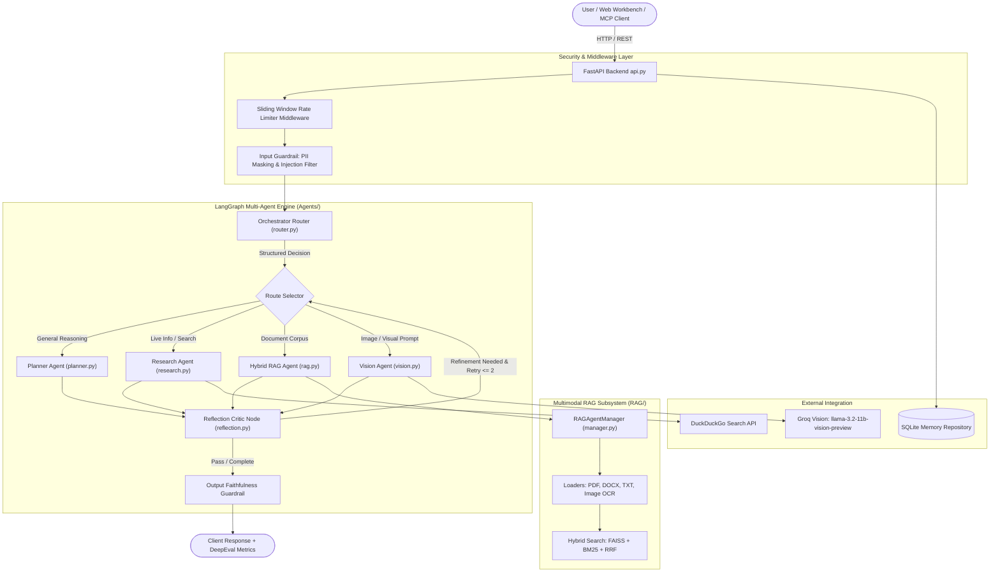
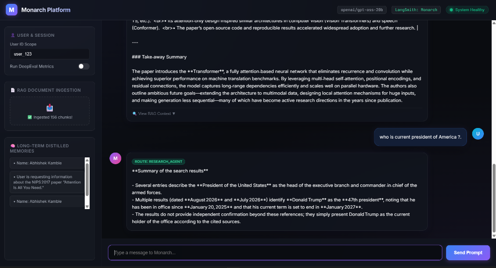
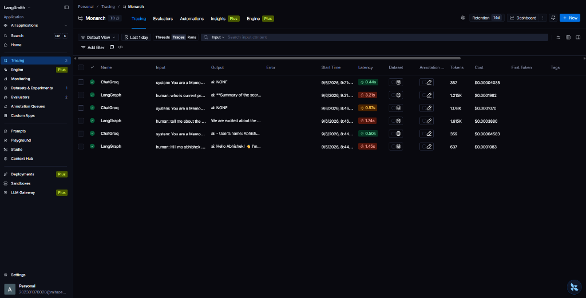

# 👑 Monarch — Production-Grade Multi-Agent AI Platform

[](https://fastapi.tiangolo.com/)
[](https://langchain-ai.github.io/langgraph/)
[](https://groq.com/)
[](https://www.docker.com/)
[](https://aws.amazon.com/)
[](LICENSE)

**Monarch** is an enterprise-level multi-agent orchestration platform built with **LangGraph**, **Groq Vision**, **FastAPI**, **Hybrid RAG (FAISS + BM25)**, **FastMCP**, **Enterprise Guardrails**, **Reflection Loop Engineering**, and **Automated Evaluation Harnesses**.

It handles multimodal processing across **Text**, **Images**, **PDFs**, and **DOCX** files, enforcing robust PII masking, rate limiting, and output faithfulness checks out of the box.

---

## 🏗 System Architecture



---

## 📁 Repository Directory Structure

```
Monarch/
├── .env                        # Environment API keys & global configurations
├── Dockerfile                  # Container build instructions with OCR & PDF libraries
├── docker-compose.yml          # One-command multi-service orchestration
├── pyproject.toml              # Project dependencies & metadata
├── requirements.txt            # Python dependencies (LangGraph, Groq, FAISS, PyPDF, Docx, etc.)
├── main.py                     # Primary CLI application entrypoint & test harness driver
├── api.py                      # FastAPI REST service with rate limiting & endpoints
├── index.html                  # Monarch Web Workbench HTML interface
├── static/                     # Web UI styles & JavaScript logic
│   ├── app.js                  # Frontend REST API integration & image base64 uploader
│   └── style.css               # Glassmorphism dark mode stylesheet
│
├── Agents/                     # LangGraph Multi-Agent Workflow Core
│   ├── __init__.py             # Exports state, nodes, and compiled graph
│   ├── state.py                # Canonical LangGraph State schema & Pydantic RouteDecision
│   ├── router.py               # Orchestrator routing node with Input Guardrail integration
│   ├── planner.py              # General planning & reasoning agent node
│   ├── research.py             # Live web search research agent node
│   ├── rag.py                  # Document RAG agent node
│   ├── vision.py               # Multimodal Groq Vision agent node
│   ├── reflection.py           # Reflection critic node for self-correction loops
│   └── graph.py                # LangGraph workflow builder with reflection loops
│
├── guardrails/                 # Security, Safety, & Output Verification
│   ├── __init__.py             # Guardrails package initialization
│   ├── input_guard.py          # PII masking (Emails, Keys, Cards) & prompt injection defense
│   └── output_guard.py         # Output RAG faithfulness & hallucination verification
│
├── harness/                    # Automated Evaluation & Regression Testing
│   ├── __init__.py             # Evaluation harness package
│   └── eval_suite.py           # Automated benchmark suite runner across agent routes
│
├── RAG/                        # Multimodal Hybrid RAG Subsystem
│   ├── __init__.py             # Exports RAGAgentManager and rag_manager singleton
│   ├── embeddings.py           # HuggingFace embeddings wrapper
│   ├── retriever.py            # Hybrid retrieval (FAISS + BM25 + Reciprocal Rank Fusion)
│   └── manager.py              # Document loader (PDF, DOCX, TXT, OCR), chunking & vector store
│
├── SQL/                        # Memory Persistence & Database Repositories
│   ├── schema.sql              # Database DDL schema (user_memories, chat_messages)
│   ├── db.py                   # SQLite / PostgreSQL database connection manager
│   ├── repository.py           # MemoryRepository for durable chat persistence
│   └── memory_consolidator.py  # Asynchronous background memory fact distillation
│
├── MCP/                        # Model Context Protocol
│   ├── __init__.py             # Exports run_mcp_server
│   └── server.py               # FastMCP streamable HTTP server exposing system tools
│
└── utils/                      # Utilities & Middleware
    ├── config.py               # Auto-resolving Groq LLM model selector & settings
    ├── logger.py               # Centralized logging instance
    ├── retry.py                # Exponential backoff retry decorator (@llm_retry)
    ├── rate_limiter.py         # In-memory sliding window rate limiter middleware
    └── eval.py                 # DeepEval metric scoring hook
```

---

## 🌟 Key Technical Features

### 1. 🖼️ Multimodal Support (Text, Image, PDF, DOCX)
* **Text & Markdown**: Index `.txt` and `.md` files directly.
* **PDFs & Word Docs**: Ingest `.pdf`, `.docx`, and `.doc` files via `PyPDFLoader` and `Docx2txtLoader`.
* **Vision & Image Processing**: Direct image prompts handled by **Groq Vision** (`llama-3.2-11b-vision-preview`). OCR ingestion for `.png`, `.jpg`, `.jpeg` via `pytesseract`.

### 2. 🛡️ Enterprise Guardrails Layer
* **Input Guardrail (`guardrails/input_guard.py`)**: Sanitizes user inputs, masks sensitive PII (Emails, API Keys, Phone Numbers, Credit Cards), and blocks restricted prompt injection attacks.
* **Output Guardrail (`guardrails/output_guard.py`)**: Verifies RAG responses against retrieved context to ensure faithfulness and flag ungrounded hallucinations.

### 3. 🔄 Loop Engineering (Reflection & Self-Correction)
* **Reflection Node (`Agents/reflection.py`)**: Evaluates agent output quality.
* **Self-Correction Loop (`Agents/graph.py`)**: Automatically triggers refinement loops (up to 2 retries) with critique feedback if responses are incomplete or ungrounded.

### 4. ⏱️ Rate Limiting Middleware
* **Sliding Window Rate Limiter (`utils/rate_limiter.py`)**: Enforces IP-based rate limits (`/api/chat`: 20 req/min, `/api/ingest`: 10 req/min) returning `HTTP 429` with `Retry-After` headers.

### 5. 🧪 Automated Evaluation Harness
* Benchmark runner (`harness/eval_suite.py`) testing routing precision, guardrail enforcement, and execution latency via CLI.

---

## 📸 Observability & Live Execution Proof

### 💬 Interactive Web Workbench Interface
Monarch features a production-grade Web Workbench supporting document ingestion, real-time agent routing, memory management, and vision analysis:



### 📊 Real-Time LangSmith Traces & Cost Tracking
Full observability into agent execution steps, LLM latencies, token consumption, and cost breakdown per query run:



---

## 🚀 Quickstart & Installation

### 1. Prerequisites
* Python 3.11+
* Groq API Key (Sign up at [console.groq.com](https://console.groq.com))

### 2. Environment Setup
Clone the repository and set up environment variables:

```bash
# Copy example environment file
cp .env.example .env
```

Edit `.env` and set your credentials:

```env
GROQ_API_KEY=gsk_your_groq_api_key_here
GROQ_MODEL=llama-3.3-70b-versatile
VISION_MODEL=llama-3.2-11b-vision-preview

# Optional LangSmith Observability
LANGCHAIN_TRACING_V2=true
LANGCHAIN_API_KEY=lsv2_pt_your_key_here
LANGCHAIN_PROJECT=Monarch
```

### 3. Install Dependencies

```bash
pip install -r requirements.txt
```

---

## 💻 Usage & Deployment Options

### 1. 🌐 Run FastAPI REST Backend & Web Workbench

Start the FastAPI application:

```bash
python main.py --serve-api
```

* **Web Workbench UI**: Open `http://localhost:8000` in your browser.
* **Swagger OpenAPI Docs**: Open `http://localhost:8000/docs`.

---

### 2. 🐳 Docker & Docker Compose Deployment

Monarch is fully containerized with built-in support for OCR and PDF rendering libraries.

#### Using Docker Compose:
```bash
docker-compose up -d --build
```

#### Using Docker CLI:
```bash
# Build Container Image
docker build -t monarch-app .

# Run Container
docker run -d -p 8000:8000 --env-file .env --name monarch monarch-app
```

---

### 3. ☁️ AWS Cloud Infrastructure Deployment

Monarch is configured and deployed on **Amazon Web Services (AWS)** using containerized Docker execution.

* **Production Architecture**: Deployed as a containerized cloud service on AWS with automated health monitoring via `/api/health`.
* **Security & Environment Isolation**: All API credentials (`GROQ_API_KEY`, etc.) are secured in AWS environment configuration stores.
* **Multimodal API Endpoint**: Exposes production REST endpoints for multi-agent reasoning, RAG ingestion, memory distillation, and vision processing.

---

### 4. 🧪 Run Automated Evaluation Test Harness

Execute the automated regression benchmark suite:

```bash
python main.py --run-harness
```

---

### 5. 📄 Ingest Documents into RAG Store via CLI

```bash
python main.py --ingest ./path/to/document.pdf --user-id user_123
```

---

### 6. 🌐 Launch FastMCP Tool Server

Expose Monarch tools over Model Context Protocol (Streamable HTTP):

```bash
python main.py --serve-mcp
```

---

## 📄 License
This project is licensed under the MIT License.