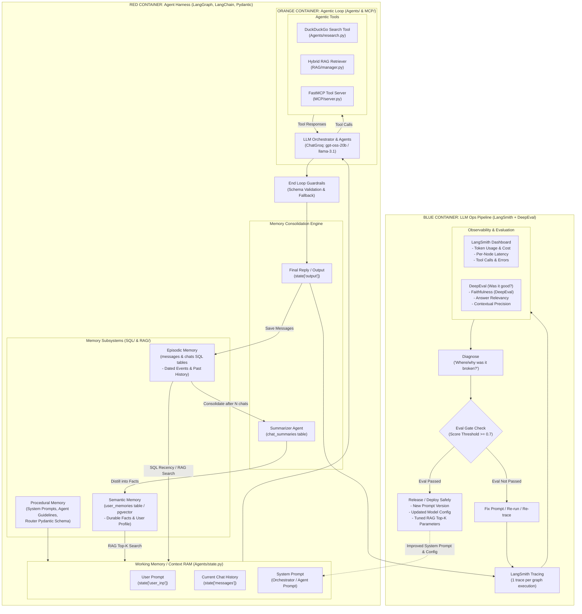

# Monarch — Enterprise Agent Architecture & LLM Ops Blueprint

This document details the complete end-to-end architecture of **Monarch**, modeled after the production **Agent Harness, Dual Memory, Agentic Loop, and LLM Ops** blueprint, including **LangSmith Observability**.

---

## 🏛 System Architecture Diagram



---

## 🔍 Detailed Component Breakdown

### 1. Harness Layer (`Agents/state.py` & `Agents/graph.py`)
- **Working Memory / Context RAM**: Encapsulated by LangGraph's `State` TypedDict. Holds ephemeral prompt states, active message turns, retrieved RAG context, and user identifiers.
- **Guardrails & Schema Enforcement**: Uses Pydantic (`RouteDecision`) to guarantee valid agent destination choices (`planner`, `research_agent`, `rag_agent`).

### 2. Memory Taxonomy (`SQL/` & `RAG/`)

| Memory Type | Implementation | Storage Engine | Purpose |
| :--- | :--- | :--- | :--- |
| **Procedural Memory** | `Agents/router.py`, `Agents/state.py` | System Prompts & Schemas | Instructs agents on rules, routing criteria, and execution behaviors. |
| **Semantic Memory** | `SQL/schema.sql` (`user_memories`) | PostgreSQL + `pgvector` (Cosine Distance) | Holds long-term durable user facts and user profile attributes across sessions. |
| **Episodic Memory** | `SQL/schema.sql` (`messages`, `chats`) | PostgreSQL / SQLite Database | Holds raw, timestamped conversation history per chat session. |
| **Memory Consolidation** | `chat_summaries` table & Summarizer Node | DB Repository (`SQL/repository.py`) | Compresses episodic conversation history into concise running summaries and distills new facts into Semantic Memory. |

---

### 3. Agentic Tool Loop (`Agents/` & `MCP/`)
- **Planner Agent (`Agents/planner.py`)**: Executes multi-step reasoning using `ChatGroq`.
- **Research Agent (`Agents/research.py`)**: Invokes DuckDuckGo web search API (`ddgs`) for real-time web information.
- **RAG Agent (`Agents/rag.py`)**: Queries `RAGAgentManager` combining vector embeddings (`FAISS`) and keyword indexing (`BM25`) via Reciprocal Rank Fusion (RRF).
- **FastMCP Protocol (`MCP/server.py`)**: Exposes tool capabilities over Streamable-HTTP (`http://127.0.0.1:8000/mcp`) for external LLM integrations.

---

## 🛠 4. LangSmith Integration for Full Observability

Monarch uses **LangSmith** natively in the **LLM Ops (Blue Container)** to trace every single execution step, node transition, tool call, prompt payload, latency metric, and token count.

### 4.1 Environment Configuration (`.env`)

To enable LangSmith tracing across the entire Monarch system, add the following variables to your `.env`:

```env
# Enable LangSmith Tracing
LANGCHAIN_TRACING_V2=true
LANGCHAIN_ENDPOINT="https://api.smith.langchain.com"
LANGCHAIN_API_KEY="ls__your_langsmith_api_key_here"
LANGCHAIN_PROJECT="Monarch-Production"
```

### 4.2 How Monarch Auto-Detects & Traces

Monarch's [utils/config.py](file:///d:/Ai_platform_Monarch/utils/config.py#L15-L25) automatically checks for `LANGCHAIN_API_KEY` at startup. When present:

1. **Automatic Graph Tracing**: LangGraph (`Agents/graph.py`) automatically streams every graph execution tree (Orchestrator -> Decision -> Agent Node -> Tool Call -> Response) to LangSmith.
2. **Metadata & Tagging**: Every run is tagged with the project name (`Monarch-Production`) and session `thread_id`.
3. **Latency & Token Metrics**: LangSmith tracks per-node execution time, total prompt tokens, completion tokens, and estimated cost.
4. **Error & Retry Capturing**: Any failed API call or `@llm_retry()` backoff is captured with full stack trace for immediate diagnosis.

### 4.3 Viewing Traces in LangSmith Dashboard

When you run `python main.py` and ask a question:
1. Open [https://smith.langchain.com](https://smith.langchain.com).
2. Select the project `Monarch-Production`.
3. View the live execution tree:
   ```text
   └─ StateGraph (ainvoke)
      ├─ orchestrator (_route_decision) -> RouteDecision(agent='research_agent')
      └─ research_agent
         ├─ DuckDuckGoSearchRun.invoke("query")
         └─ ChatGroq.invoke("Summarize results...")
   ```

---

## 📂 Mapping to Monarch Source Code

```
Monarch Base Architecture
├── Harness (LangGraph Engine)
│   ├── State RAM          --> Agents/state.py (State)
│   ├── Procedural Memory  --> Agents/router.py (Pydantic Schema)
│   ├── Semantic Memory    --> SQL/schema.sql (user_memories / pgvector)
│   ├── Episodic Memory    --> SQL/schema.sql (messages, chats)
│   └── Consolidation      --> SQL/repository.py (chat_summaries)
│
├── Agentic Loop
│   ├── LLM Core           --> utils/config.py (ChatGroq + auto-resolution)
│   ├── Search Tool        --> Agents/research.py (DuckDuckGo)
│   ├── RAG Tool           --> RAG/manager.py (FAISS + BM25 + RRF)
│   └── FastMCP Server     --> MCP/server.py (Streamable-HTTP)
│
└── LLM Ops
    ├── LangSmith Tracing  --> utils/config.py (LANGCHAIN_TRACING_V2)
    ├── Logging & Trace    --> utils/logger.py
    ├── Evaluation Engine  --> utils/eval.py (DeepEval)
    └── Resilience & Retry --> utils/retry.py (@llm_retry)
```
