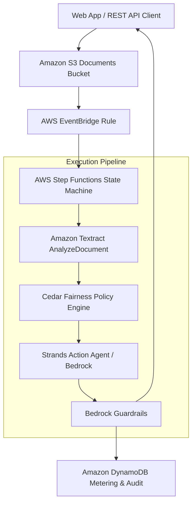

# Monarch / Vasooli Architecture & Pipeline Diagram

```mermaid
graph TD
    Client[Web App / REST API Client] --> S3[Amazon S3 Documents Bucket]
    S3 --> EventBridge[AWS EventBridge Rule]
    EventBridge --> StepFunctions[AWS Step Functions State Machine]
    
    subgraph Execution Pipeline
        StepFunctions --> Textract[Amazon Textract AnalyzeDocument]
        Textract --> Cedar[Cedar Fairness Policy Engine]
        Cedar --> Strands[Strands Action Agent / Bedrock]
        Strands --> Guardrails[Bedrock Guardrails]
    end
    
    Guardrails --> DynamoDB[Amazon DynamoDB Metering & Audit]
    Guardrails --> Client
```
