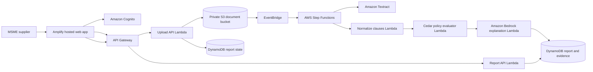

# Wemboo Clause Guard - Winning Hackathon Roadmap

## Product Thesis

**Wemboo Clause Guard** helps an Indian MSME supplier identify risky delayed-payment terms in a buyer contract, understand the evidence behind the finding, and prepare a safe next action.

The winning build is deliberately narrow. It is not a generic AI legal chatbot or a large SaaS suite. It is a trustworthy, AWS-native document workflow:

```text
Upload contract -> Extract facts -> Evaluate policy -> Explain evidence -> Draft next action
```

### One-line pitch

"Upload a buyer contract; Wemboo identifies potential MSME delayed-payment risks using policy-as-code, shows the exact evidence, and drafts a grounded counter-clause for human review."

### Problem and user

Indian MSME suppliers often accept buyer agreements containing long payment cycles, waived delayed-payment interest, or unilateral cancellation terms. They need a fast way to triage the agreement before signing or pursuing a payment recovery action.

**Primary user:** a small or medium supplier reviewing a purchase order, invoice, or service agreement.

**User outcome:** a clear, evidence-backed report in minutes, not an unqualified legal conclusion.

## Eligibility and Submission Rules

This repository is a reference only. The hackathon project must be built in a fresh public repository after the event begins. Do not submit this repository, rewrite its Git history, or portray prior work as event work.

Before the event, planning, architecture practice, service tutorials, and team preparation are allowed. During the event:

- Create a new repository and make the first commit after the clock starts.
- Build the feature being judged during the event window.
- Credit libraries, public APIs, templates, and AI coding tools used.
- Submit a public repository, deployed URL, three-minute video, and short writeup before the deadline.
- Record the real deployed system. A capability not shown in the video does not count.

## Success Criteria

The project is ready for submission only when all of the following are true:

- A real PDF or image uploads from a fresh browser session.
- The file is stored in a private, tenant-scoped S3 location.
- Amazon Textract extracts text from that uploaded file.
- The backend stores normalized facts, source page, and extraction confidence.
- Cedar evaluates deterministic policy rules and exposes the policy ID/version that fired.
- Amazon Bedrock receives only saved evidence and policy findings, then drafts an informational counter-clause or checklist.
- Cognito identity determines tenant access; the client never supplies a trusted tenant ID.
- A second signed-in user cannot retrieve the first user's report or document.
- A compliant sample and a risky sample both produce correct results.
- The deployed URL, test suite, and demo workflow work without a simulated fallback.

## Scope Boundary

### Build

1. Authenticated upload of a contract PDF/image.
2. Asynchronous document processing status.
3. Extracted-clause evidence view with page number and confidence.
4. Three deterministic MSME-risk rules evaluated by Cedar.
5. Grounded Bedrock explanation and proposed counter-clause.
6. Secure report retrieval and a simple downloadable evidence report.
7. Deployed AWS architecture, test evidence, and a focused demo.

### Explicitly do not build

- Billing, pricing, Razorpay, subscriptions, or API-key management.
- Generic chat, RAG memory, generic multi-agent orchestration, or ERP connectors.
- Automatic legal filing, exact interest calculations, or claims of legal advice.
- More policy domains than payment terms.
- Any mocked result that appears to be a real analysis.

If a feature cannot be shown working in the recorded video, remove it from navigation and the writeup.

## Target Architecture



### Component responsibilities

| Component | Responsibility | Why it belongs in the build |
| --- | --- | --- |
| Amplify Hosting | Serve the web app | Live URL and simple frontend deployment |
| Cognito | Authenticate users | Real identity and tenant boundary |
| API Gateway + Lambda | Issue upload URL, start workflow, return reports | Small, serverless API surface |
| S3 | Store original documents privately | Durable document storage with tenant prefix isolation |
| EventBridge + Step Functions | Coordinate asynchronous processing | Visible, reliable orchestration for the demo |
| Textract | Extract document text and structure | Real value from uploaded PDF/image |
| Cedar | Evaluate deterministic rules | Versioned, explainable policy decisions |
| Bedrock | Explain findings and draft next action | Grounded natural-language value |
| DynamoDB | Store report, evidence, status, audit events | Low-ops report retrieval and audit trail |
| CloudWatch | Logs, traces, and operational evidence | Makes the architecture demonstrably real |

### Security model

- Use the Cognito `sub` claim as the tenant key.
- Store uploads only at `private/<sub>/<document_id>/original.<ext>`.
- Generate short-lived presigned upload URLs only for that prefix.
- Use IAM least-privilege policies: each Lambda receives only the actions and resources it needs.
- Query reports by both `tenant_id` and `report_id`; never look up a report by ID alone.
- Keep the S3 bucket private, encrypted, and without public ACLs.
- Do not log raw contracts or personal identifiers in application logs.
- Add a simple retention setting and document the deletion behavior.
- Do not ship a development admin fallback, default secret, unsigned JWT acceptance, or wildcard CORS with credentials.

## Data Model

Use one DynamoDB table for hackathon simplicity.

```text
PK = TENANT#<cognito-sub>
SK = DOCUMENT#<document-id>
     REPORT#<report-id>
     EVENT#<timestamp>#<event-id>
```

### Report record

```json
{
  "tenant_id": "Cognito sub",
  "report_id": "uuid",
  "document_id": "uuid",
  "status": "COMPLETE",
  "created_at": "ISO-8601",
  "policy_pack": "msme-payment-v1",
  "findings": [
    {
      "policy_id": "PAYMENT_TERM_OVER_45_DAYS",
      "decision": "FLAGGED",
      "source_text": "Payment shall be made in 90 days...",
      "page": 2,
      "confidence": 98.2,
      "normalized_facts": {"payment_days": 90},
      "needs_human_review": false
    }
  ],
  "grounded_guidance": {
    "summary": "...",
    "counter_clause": "...",
    "limitations": "Informational guidance only; verify eligibility and facts."
  }
}
```

## Policy Design

Start with three rules. Each must be deterministic, individually tested, and explainable.

| Policy ID | Normalized input | Trigger | User-facing result |
| --- | --- | --- | --- |
| `PAYMENT_TERM_OVER_45_DAYS` | `payment_days` | Greater than 45 | Potential delayed-payment compliance risk |
| `STATUTORY_INTEREST_WAIVER` | `interest_waived` | `true` | Potential risk from excluding delayed-payment interest |
| `UNILATERAL_TERMINATION` | `unilateral_termination` | `true` | One-sided termination term requiring review |

### Policy rules of engagement

- Display the original extracted text for each finding.
- Preserve page number, extraction confidence, and policy version.
- Mark low-confidence extraction or ambiguous wording as `NEEDS_REVIEW`.
- Do not flag a clause because it contains a vague keyword such as `disbursement`.
- Do not call a clause illegal, void, enforceable, or legally decisive.
- State that the result is informational and depends on facts such as supplier eligibility, buyer relationship, and agreement context.

## Bedrock Grounding Contract

Bedrock is an explanation layer, not the decision engine.

### Allowed input

- Exact extracted clause text.
- Page number and confidence.
- Cedar policy ID, decision, and normalized facts.
- Approved static statutory reference snippets.

### Required structured output

```json
{
  "summary": "Plain-language explanation based only on supplied evidence.",
  "counter_clause": "A proposed contractual clause for review.",
  "next_steps": ["Verify MSME eligibility", "Discuss proposed wording"],
  "limitations": "Informational guidance only; consult a qualified professional."
}
```

### Guardrails

- Reject output that adds a fact not present in the input evidence.
- Never fabricate a case citation, government filing number, interest amount, or legal outcome.
- Always include the limitations statement.
- If evidence is insufficient, output `needs_human_review` instead of a confident conclusion.

## Event Delivery Plan

### Before the event: learn and prepare, do not build the entry

- Read the hackathon rules and verify the exact start/deadline.
- Create an AWS Builder Center profile and obtain the credits/sandbox needed for Ship It.
- Practice independently with Cognito, S3 presigned URLs, Textract, Step Functions, Cedar, Bedrock, DynamoDB, and Amplify.
- Draft architecture, user story, acceptance criteria, sample document text, and demo script.
- Assign team responsibilities and agree on one decision-maker for scope cuts.
- Prepare a list of third-party assets and tools to disclose in the writeup.

### Day 1: establish a deployed vertical slice

**Outcome:** A signed-in user uploads a file and sees a real processing state.

- Create the new public repository after the event begins.
- Add a concise README with the problem, architecture, and build log.
- Deploy Cognito, S3, API Gateway, Lambda, DynamoDB, and Amplify.
- Implement sign-in and tenant-scoped presigned upload URL issuance.
- Store a `PROCESSING` report record in DynamoDB.
- Trigger a Step Functions workflow when the upload completes.
- Add CloudWatch logs with correlation IDs, without raw document text.

**Day 1 exit gate:** A fresh user can upload one real file at the deployed URL, and the object appears in the correct S3 prefix.

### Day 2: make extraction and policy decisions real

**Outcome:** The system identifies one compliant and one risky payment clause correctly.

- Add asynchronous Textract processing to the state machine.
- Build a normalizer that extracts candidate payment terms with source page/confidence.
- Implement the three Cedar rules and policy-version field.
- Store raw evidence, normalized facts, and policy results in DynamoDB.
- Build the report view: original clause, confidence, finding, and policy label.
- Write unit tests for every policy and boundary condition.

**Day 2 exit gate:** A 90-day/no-interest sample is flagged; a clear 30-day payment sample is not flagged.

### Day 3: turn evidence into action

**Outcome:** A user receives grounded, useful guidance without false legal certainty.

- Add Bedrock structured generation after Cedar evaluation.
- Enforce the grounding contract and limitations message.
- Display a counter-clause and next-step checklist beside the evidence.
- Add an HTML/JSON evidence report download only if it is stable.
- Add deletion for the current user's document/report.
- Test cross-tenant denial with two distinct Cognito users.

**Day 3 exit gate:** The same report is useful to a user, explainable to a judge, and inaccessible to another user.

### Day 4: harden, record, submit

**Outcome:** A reproducible demonstration and on-time submission.

- Execute the full workflow repeatedly from clean browser sessions.
- Fix defects before adding polish.
- Run the test suite and capture results.
- Verify IAM, private bucket access, missing-secret behavior, and error states.
- Record a first acceptable three-minute video early.
- Submit repository, URL, video, and writeup before the deadline.
- Improve visuals only after the submission is safely complete.

**Day 4 exit gate:** Every claim in the README and video is visible in the deployed application or AWS console.

## Test Plan

### Unit tests

- Payment days: 30, 45, 46, 60, and 90 days.
- Interest language: statutory language, explicit waiver, unrelated mention of interest, and absent term.
- Termination language: bilateral vs unilateral.
- Normalizer behavior for numeric and word forms such as `ninety days`.
- Low-confidence and missing extraction handling.
- Bedrock output schema validation and unsupported-fact rejection.

### Integration tests

- Authenticated user gets an upload URL only for their tenant prefix.
- S3 upload triggers one state-machine execution.
- A completed Textract result produces a report record.
- Report lookup succeeds for the owner and returns `403`/`404` for another user.
- Bad files, failed Textract jobs, failed Bedrock calls, and timeouts produce useful status without simulated findings.

### Demo fixtures

Create fixtures during the event and label them as synthetic:

1. Compliant 30-day payment clause.
2. Risky 90-day payment clause with interest waiver.
3. Ambiguous low-confidence scan that becomes `NEEDS_REVIEW`.

## Three-Minute Demo Script

| Time | What judges see | Point being proven |
| --- | --- | --- |
| 0:00-0:20 | Delayed-payment problem and target user | Real impact |
| 0:20-0:50 | Sign in and upload a real synthetic contract | Working product, Cognito, S3 |
| 0:50-1:20 | Processing state then extracted source clause | Textract and orchestration |
| 1:20-1:55 | Cedar policy ID, evidence, confidence, and decision | Deterministic explainability |
| 1:55-2:25 | Grounded Bedrock counter-clause and limitations | Useful AI, safely constrained |
| 2:25-2:45 | Deployed architecture plus Step Functions/DynamoDB/CloudWatch | AWS is essential, not decorative |
| 2:45-3:00 | What the team learned and next-step impact | Learning and realistic vision |

Do not show a mocked result, a broken upload, placeholder dashboard data, or services that are not actually deployed.

## Judge Questions and Answers

### Why Cedar instead of asking an LLM to decide?

Cedar makes the policy decision deterministic, testable, versioned, and auditable. Bedrock explains the result; it does not decide the rule outcome.

### How do you prevent hallucinated legal advice?

The model receives only extracted evidence, normalized facts, policy findings, and approved reference snippets. Its output is structured, validated, and labeled as informational guidance rather than legal advice.

### How do you protect confidential contracts?

Cognito determines the tenant, S3 objects use tenant-scoped private prefixes, APIs authorize every report read, DynamoDB queries are tenant-scoped, and the system does not expose public document URLs.

### What happens when OCR confidence is poor?

The system surfaces the text and confidence but marks the result as requiring human review. It does not create a confident compliance finding from unreliable extraction.

### What did the team learn during the event?

Name concrete outcomes: asynchronous workflow design with Step Functions, document extraction with Textract, policy-as-code with Cedar, grounded generation with Bedrock, and least-privilege tenant isolation on AWS.

## Submission Checklist

- [ ] New repository created after the event begins.
- [ ] Repository history clearly shows event-window work.
- [ ] README includes architecture, AWS services, limitations, and AI-tool disclosure.
- [ ] Deployed URL works from an incognito browser session.
- [ ] Video is under three minutes and shows the real deployed flow.
- [ ] All architecture claims are visible in code, deployment, or video.
- [ ] Core tests pass.
- [ ] No secrets, credentials, `.env`, local database, or private documents are committed.
- [ ] Upload, policy evaluation, Bedrock explanation, and tenant isolation were rechecked before submission.
- [ ] Submission was sent early enough to recover from upload/platform failure.

## Definition of Winning

The project is winning when a judge can state, without reading the code:

"This solves a real MSME problem. The team built a live AWS workflow. The contract evidence, rule decision, and AI explanation are clearly separated. It works, it respects uncertainty, and it can plausibly help a supplier tomorrow."
